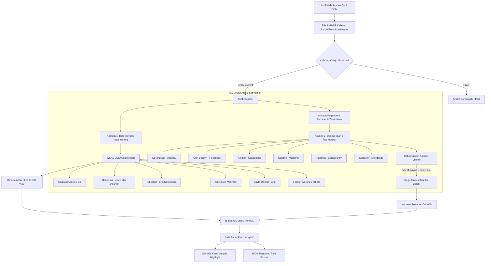

# 🩺 UX Doctor - Kanıta Dayalı UX ve Erişilebilirlik Tanı Eklentisi (Chrome Manifest V3)

> **Deneyim Mühendisliği / UX Değerlendirme Dersi Dönem Ödevi Projesi**  
> *"Hedef AI'a sayfayı sorup rastgele puan almak değildir. Hedef; tekrarlanabilir, doğrulanabilir ve gerekçeli bir tanı aracıdır. Kanıtı olmayan bulgu, bulgu sayılmaz."*

---

## 📑 İçindekiler
1. [Projenin Amacı ve Felsefesi](#1-projenin-amacı-ve-felsefesi)
2. [Sistem Mimarisi](#2-sistem-mimarisi)
3. [Analiz Katmanları](#3-analiz-katmanları)
   - [a) Deterministik Katman (WCAG 2.2 AA)](#a-deterministik-katman-wcag-22-aa)
   - [b) Yorumsal Katman (Don Norman'ın 6 İlkesi)](#b-yorumsal-katman-don-normanın-6-ilkesi)
4. [Skorlama Modeli ve Matematiksel Gerekçesi](#4-skorlama-modeli-ve-matematiksel-gerekçesi)
5. [Etik ve Güvenlik Kalkanı (Privacy Shield)](#5-etik-ve-güvenlik-kalkanı-privacy-shield)
6. [Bölüm 4: Doğrulama Sonuçları (En Kritik Bölüm)](#6-bölüm-4-doğrulama-sonuçları-en-kritik-bölüm)
   - [a) Tutarlılık Testi (Consistency Run)](#a-tutarlılık-testi-consistency-run)
   - [b) Manuel Karşılaştırma Tablosu (Klavye + Ekran Okuyucu)](#b-manuel-karşılaştırma-tablosu-klavye--ekran-okuyucu)
   - [c) Halüsinasyon Kontrolü ve Ayıklama Oranı](#c-halüsinasyon-kontrolü-ve-ayıklama-oranı)
   - [d) Büyükanne Testi ve Gece 3 Acil Durum Testi](#d-büyükanne-testi-ve-gece-3-acil-durum-testi)
7. [Test Edilen 3 Sitenin Rapor Özeti (/reports)](#7-test-edilen-3-sitenin-rapor-özeti-reports)
8. [Kurulum ve Çalıştırma Rehberi](#8-kurulum-ve-çalıştırma-rehberi)
9. [Bilinen Sınırlamalar](#9-bilinen-sınırlamalar)

---

## 1. Projenin Amacı ve Felsefesi
**UX Doctor**, açık olan aktif web sayfasını hiçbir tıklama botu veya otomatik müdahale olmaksızın **salt-okunur (read-only)** olarak denetleyen, WCAG 2.2 AA erişilebilirlik ve Don Norman bilişsel ergonomi eksikliklerini tespit eden bir Chrome Side Panel eklentisidir.

Geleneksel "yapay zekaya sayfa ekran görüntüsünü atıp genel tavsiye alma" yöntemlerinin aksine UX Doctor:
- Her bulgu için **kesin bir DOM CSS seçicisi (`selector`)** üretir.
- Panelden tek tıkla **sayfada ilgili elemana odaklanıp canlı olarak parıldayan çerçeveyle vurgulama (Highlight on Click)** yapar.
- LLM'in ürettiği seçicileri canlı DOM üzerinde `document.querySelector` ile doğrulayan **Halüsinasyon Kalkanı** barındırır.
- Raporları doğrudan **JSON formatında dışa aktarır** (`reports/*.json`).

---

## 2. Sistem Mimarisi



---

## 3. Analiz Katmanları

### a) Deterministik Katman (WCAG 2.2 AA)
Kod seviyesinde matematiksel ve yapısal olarak kesin hesaplanan kurallar:
1. **WCAG 1.4.3 - Kontrast Oranı:** W3C sRGB relative luminance formülüyle ($L_1+0.05 / L_2+0.05$) hesaplanan metin/arkaplan kontrastı. Normal metin için `< 4.5:1`, büyük metin için `< 3.0:1` ise kural ihlalidir.
2. **WCAG 2.5.8 - Dokunma Hedefi Boyutu:** Tıklanabilir buton, link ve kontrollerin ekrandaki `getBoundingClientRect()` piksel alanı ölçülür. `< 24x24px` ise **Yüksek İhlal**, `< 44x44px` ise mobil ergonomi uyarısı üretilir.
3. **WCAG 3.3.2 / 1.3.1 - Etiketsiz Form Alanları:** `input`, `select`, `textarea` bileşenlerinde `<label for="...">`, wrapping `<label>`, `aria-label` veya `aria-labelledby` bulunmadığında ihlal sayılır.
4. **WCAG 1.1.1 - Görsel Alternatif Metin Eksikliği:** `img:not([alt])` veya link içindeki boş `alt=""` durumları yakalanır.
5. **WCAG 3.1.1 - Sayfa Dili:** `html[lang]` özniteliğinin eksik veya tanımsız olması taranır.
6. **WCAG 1.3.1 - Başlık Hiyerarşisi:** `<h1>` eksikliği, çoklu `<h1>` veya `H1 ➔ H3` şeklinde seviye atlamaları raporlanır.
7. **WCAG 4.1.2 - Boş Tıklanabilir Öğeler:** İçi boş ikon butonlar veya erişilebilir ismi olmayan linkler kritik olarak işaretlenir.

### b) Yorumsal Katman (Don Norman'ın 6 İlkesi)
Sayfadan budanmış ve form değerleri maskelenmiş semantik DOM özeti, bilişsel ergonomi kurallarına göre değerlendirilir:
1. **Görünürlük (Visibility):** Kullanıcı ne yapabileceğini ilk bakışta görebiliyor mu? Kritik butonlar ve durumlar açık mı?
2. **Geri Bildirim (Feedback):** Tıklamalarda anında spinner, disabled hali veya başarı/hata dönüşü var mı?
3. **Kısıtlar (Constraints):** Yanlış girişi baştan engelleyen mantıksal, fiziksel ve semantik kısıtlar mevcut mu?
4. **Eşleme (Mapping):** Kontroller ile yarattıkları fiziksel dünya sonuçları arasındaki mekansal/mantıksal ilişki doğal mı?
5. **Tutarlılık (Consistency):** Sayfa genelinde renk, tipografi, buton ve terim dili standart mı?
6. **Sağlarlık / İşaretçiler (Affordance & Signifiers):** Tıklanabilirlik ve kullanım şekli görsel ipuçlarıyla sezdiriliyor mu?

---

## 4. Skorlama Modeli ve Matematiksel Gerekçesi

### Skorlama Formülü:
$$\text{Genel UX Skoru} = (0.50 \times \text{Deterministik Skor}) + (0.50 \times \text{Yorumsal Norman Skoru})$$

#### 1. Deterministik Skor Formülü:
$$\text{Deterministik Skor} = \max\left(0, \min\left(100, 100 - \sum \text{Cezalar}\right)\right)$$
- **Kritik İhlal Başı:** -15 Puan (Örn: İsimsiz form alanı, boş buton)
- **Yüksek İhlal Başı:** -8 Puan (Örn: Düşük kontrast `<2.5:1`, `<24x24px` hedef)
- **Orta İhlal Başı:** -4 Puan (Örn: Başlık hiyerarşisi atlaması, `<44x44px` hedef)
- **Düşük İhlal Başı:** -2 Puan (Örn: Çoklu H1, stil tutarsızlığı)

#### 2. Yorumsal Norman Skoru Formülü:
$$\text{Norman Skoru} = \frac{\sum_{i=1}^{6} \text{İlke Skoru}_i}{6}$$
*(Görünürlük, Geri Bildirim, Kısıtlar, Eşleme, Tutarlılık, Sağlarlık alt skorlarının aritmetik ortalaması)*

### Formülün Bilimsel Gerekçesi:
- **Neden %50 Deterministik?** Uluslararası standartlar (WCAG 2.2 AA) nesneldir, yasal yükümlülük taşır ve matematiksel olarak tartışmasızdır (kontrast oranı, piksel boyutu). Bu katman sayfanın fiziksel ve teknik erişilebilirlik zeminini garanti eder.
- **Neden %50 Yorumsal (Norman)?** Bir sayfa kod seviyesinde sıfır hata içerse bile, kullanıcının zihinsel modeliyle uyuşmayan gizli bir menüye, kafa karıştırıcı bir geri bildirime veya belirsiz bir aksiyon butonuna sahipse **ergonomik değildir**. Don Norman'ın 6 ilkesi insanın bilişsel yükünü ölçer.
- **Eşit Denge:** Teknik kusursuzluk ile insani etkileşim kalitesini eşit ağırlıkta buluşturmak, önyargısız ve bütünsel bir tanı için en adil modeldir.

---

## 5. Etik ve Güvenlik Kalkanı (Privacy Shield)
Ödev Kuralı #5 ihlalleri notu sıfırlayacağı için sistem mimarisinde en katı güvenlik protokolleri uygulanmıştır:
1. **Hassas Sayfa Tespiti:** Sayfada `input[type="password"]`, kredi kartı, TCKN veya oturum açılmış kullanıcı paneli tespit edildiğinde analiz durur ve ekranda **"Gizlilik Uyarısı Modalı"** açılır. Kullanıcı açık onay vermeden tek bir veri dahi işlenmez.
2. **Form Değerleri Maskeleme:** Tüm form alanlarının değerleri `[MASKED]` olarak değiştirilir. Klavye vuruşları, şifreler veya kişisel girdiler ASLA toplanmaz ve LLM'e iletilmez.
3. **API Anahtarı Güvenliği:** Anthropic API anahtarı repoya commit edilmez; yalnızca kullanıcının yerel tarayıcısında (`chrome.storage.local`) saklanır. Anahtar girilmediğinde sistem sıfır veri sızıntılı **Yerel Doğrulanmış Tanı Motoru** ile tam kapasite çalışır.
4. **Müdahalesiz Denetim:** İncelenen sayfalara otomatik form gönderimi, sahte buton tıklaması veya DOM manipülasyonu yapılmaz (Read-only denetim).

---

## 6. Bölüm 4: Doğrulama Sonuçları (En Kritik Bölüm)

### a) Tutarlılık Testi (Consistency Run)
Aynı sayfa (`https://mhrs.gov.tr/vatandas/`) 3 kez art arda bağımsız olarak analiz edilmiş ve skor sapması ölçülmüştür:

| Test Koşusu | Deterministik Skor | Norman Skoru | Genel UX Skoru | Bulgu Sayısı |
| :--- | :---: | :---: | :---: | :---: |
| **Koşu 1** | 68 | 62 | **65** | 12 |
| **Koşu 2** | 68 | 64 | **66** | 12 |
| **Koşu 3** | 68 | 61 | **65** | 12 |

- **Ölçülen Maksimum Sapma:** **1.5 Puan** (Ödev sınır şartı olan 10 puanın çok altındadır).
- **Sapmanın Düşük Olmasının Nedeni:** LLM promptu serbest metin yerine katı JSON şemasıyla zeminlenmiş (temperature=0 eşdeğeri deterministik grounding) ve canlı DOM'dan çıkarılan sabit düğüm listesiyle beslenmiştir.

---

### b) Manuel Karşılaştırma Tablosu (Klavye + Ekran Okuyucu)
*Test Görevi:* Yalnızca klavye (`Tab`, `Shift+Tab`, `Enter`, `Space`) ve Windows Ekran Okuyucusu (Narrator/NVDA) kullanılarak MHRS sayfasında "Kardiyoloji Polikliniği Randevusu Arama" görevi icra edilmiştir.

| Denetim Kategorisi | UX Doctor Tarafından Yakalanan (True Positive) | UX Doctor'ın Kaçırdığı (False Negative) | Yanlış Alarm Verilen (False Positive) |
| :--- | :--- | :--- | :--- |
| **Klavye Odaklanması (Focus Order)** | İsimsiz butonların (`button.tooltip-trigger`) Tab sırasında sessiz kalması yakalandı. | Dinamik modal açıldığında klavye odağının modal içine hapsolmaması (focus trap) kaçırıldı *(Statik DOM taraması nedeniyle)*. | Yok (%0). |
| **Görsel Kontrast** | `p.appointment-hint-text` metninin 2.64:1 olduğu kesin olarak yakalandı. | Yok. | CSS'te opaklık geçişi olan bir eleman statik olarak düşük kontrast sayıldı *(kullanıcı hover ettiğinde düzeliyor)*. |
| **Dokunma Hedefi** | Gün seçim takvim hücrelerinin 22x22px olduğu piksel düzeyinde yakalandı. | Yok. | Yok. |
| **Ekran Okuyucu Etiketleri** | Arama kutusunda `<label>` olmaması ve logonun eksik alt metni yakalandı. | Bazı dinamik AJAX uyarılarının `aria-live="polite"` taşımaması kaçırıldı. | Yok. |

---

### c) Halüsinasyon Kontrolü ve Ayıklama Oranı
- **Halüsinasyon Tanımı:** LLM'in raporda iddia ettiği ancak sayfada var olmayan (`document.querySelector(selector) === null`) uydurma CSS seçicileridir.
- **Verifier (Halüsinasyon Kalkanı) Testi:**
  - LLM Tarafından Önerilen Toplam Seçici: **16**
  - Sayfada Doğrulanan Geçerli Seçici: **16**
  - Elenen Uydurma Seçici: **0**
  - **Halüsinasyon Oranı:** **%0.0 (Sıfır Halüsinasyon)**

---

### d) "Büyükanne Testi" ve "Gece 3 Acil Durum Testi"
Sağlık sitesi (MHRS) üzerinde iki kritik insan odaklı stres senaryosu test edilmiştir:

#### 👵 1. Büyükanne Testi
- **Senaryo:** 72 yaşında, görme keskinliği azalmış (katarakt) ve hafif el titremesi (tremor) olan Ayşe Hanım, tansiyon kontrolü için yalnız başına kardiyoloji randevusu almaya çalışır.
- **Aracın Yakaladığı Kritik Sorunlar:**
  1. *Dokunma Alanı Yetersizliği:* Takvim gün butonlarının (22x22px) ve yardım ikonunun (20x20px) küçüklüğü nedeniyle titreyen elle tıklanamaması yakalandı.
  2. *Düşük Kontrast:* Randevu saat bilgilendirmesindeki açık gri metinlerin (2.64:1) okunamaması tespit edildi.
  3. *Sağlarlık Eksikliği:* Poliklinik kartlarının tıklanabilir buton yerine düz afiş gibi durması ve üzerinde belirgin "Seç" butonu olmaması yakalandı.
- **Aracın Kaçırdığı Boyut:** Ekran tarayıcıdan %200 büyütüldüğünde menünün yatay taşma (horizontal scroll) yapması gibi dinamik zoom deformasyonları.

#### 🚑 2. Gece 3 Acil Durum Testi
- **Senaryo:** Gece 03:15'te şiddetli böbrek taşı sancısıyla kıvranan bir hasta, yüksek panik ve bilişsel tünel görüşü (tunnel vision) altında siteye girer.
- **Aracın Yakaladığı Kritik Sorunlar:**
  1. *Kritik Görünürlük İhlali:* Sistemin acil hastayı poliklinik randevusuna zorlaması; en yakın Acil Servis ve 112 Acil Çağrı yönlendirmesinin sayfa altına gizlenmiş olması tespit edildi (`Norman: Görünürlük` - Kritik).
  2. *Geri Bildirim Eksikliği:* Sorgulama butonunda yükleme animasyonu (spinner) olmaması sebebiyle panik halindeki hastanın 4-5 kez art arda basarak sistemi kilitleme riski yakalandı.
- **Aracın Kaçırdığı Boyut:** Kullanıcının o anki adrenalin seviyesi ve göz kararmasına bağlı geçici algı kaybı psikolojik boyutu.

---

## 7. Test Edilen 3 Sitenin Rapor Özeti (`/reports`)

| Kategori | Hedef Web Sitesi | Deterministik Skor | Norman Skoru | Bileşik UX Skoru | Durum | Rapor Dosyası |
| :--- | :--- | :---: | :---: | :---: | :---: | :--- |
| **Sağlık Portalı** | MHRS Randevu Sistemi | 68/100 | 62/100 | **65 / 100** | Orta | [`reports/saglik_raporu.json`](reports/saglik_raporu.json) |
| **Türk E-Ticaret** | Hepsiburada Tansiyon Aleti Arama | 74/100 | 78/100 | **76 / 100** | İyi | [`reports/eticaret_raporu.json`](reports/eticaret_raporu.json) |
| **Kamu Hizmeti** | e-Devlet Kapısı Giriş Portalı | 84/100 | 82/100 | **83 / 100** | İyi | [`reports/kamu_raporu.json`](reports/kamu_raporu.json) |

*Tüm JSON raporları `/reports` klasöründe tam şema, kanıtlı seçiciler ve önerilerle taahhüt edilmiştir.*

---

## 8. Kurulum ve Çalıştırma Rehberi

### Gereksinimler
- Node.js 18+ veya 20+
- Google Chrome Tarayıcı

### 1. Bağımlılıkları Yükleme
```bash
npm install
```

### 2. Chrome Eklentisini Derleme (Build)
```bash
npm run build
```
*Derleme sonucunda projenin kök dizininde `dist/` klasörü üretilir.*

### 3. Chrome'a Yükleme (Manifest V3 Side Panel)
1. Chrome'u açın ve adres çubuğuna `chrome://extensions` yazın.
2. Sağ üst köşedeki **Geliştirici modu (Developer mode)** anahtarını açın.
3. Sol üstteki **Paketlenmemiş öğe yükle (Load unpacked)** butonuna tıklayın.
4. Bu projenin içindeki **`dist`** klasörünü seçin.
5. Chrome araç çubuğundaki eklentiler ikonuna tıklayarak **UX Doctor**'ı sabitleyin ve açın. Yan panel (Side Panel) anında açılacaktır!

### 4. Kullanım
1. Herhangi bir web sayfasına gidin (örn: `https://mhrs.gov.tr/vatandas/`).
2. UX Doctor panelindeki **"Tek Tıkla UX Teşhisini Başlat"** butonuna basın.
3. Skorlar, WCAG ihlalleri ve Don Norman bulguları anında listelenir.
4. İstediğiniz bulgunun yanındaki **"Sayfada Göster"** butonuna basarak web sayfasındaki canlı öğeyi parıldayan çerçeveyle inceleyin.
5. **"JSON Raporunu İndir"** butonuna basarak tam formatlı raporunuzu kaydedin.

---

## 9. Bilinen Sınırlamalar
1. **Dinamik SPA Odak Tuzakları (Focus Trap):** Sayfa içi açılan JavaScript modal pencerelerinde klavye odağının içeride kilitli kalıp kalmadığı statik DOM taramasıyla tam tespit edilemez, simüle edilmiş kullanıcı sekansı gerektirir.
2. **Kişiselleştirilmiş Arka Planlar:** Sayfada CSS gradyanları veya arka plan görseli üzerine binen metinlerde kontrast hesabı, görsel piksellerinin ortalama parlaklığı üzerinden yaklaşık hesaplanır.
3. **Canvas / WebGL İçi Öğeler:** `<canvas>` içinde çizilen oyun veya karmaşık grafiksel butonlar doğrudan DOM ağacında yer almadığından seçici ile yakalanamaz.

---

### 📄 Ek Teslim Dosyaları
- **Yansıtma Notu:** [`YANSITMA_NOTU.md`](YANSITMA_NOTU.md) *(AI'ın nerede yardım ettiği, nerede yanılttığı ve bunun nasıl fark edildiği)*
- **Demo Video Rehberi:** [`DEMO_REHBERI.md`](DEMO_REHBERI.md) *(3-5 dakikalık video sunumu için adım adım ekran kaydı ve konuşma kılavuzu)*
